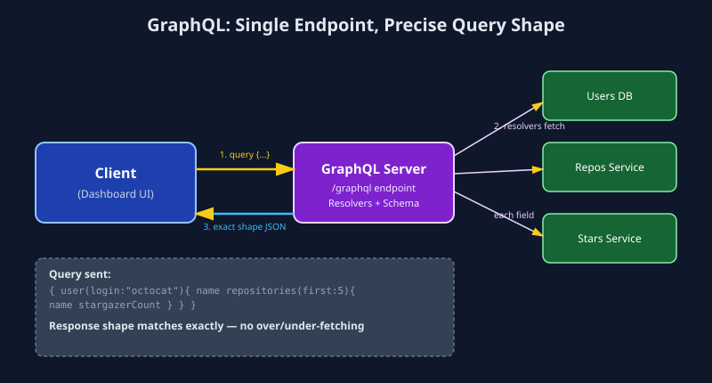

# GraphQL

## 1. What is GraphQL?

GraphQL is a **query language and runtime for APIs** developed by Facebook (Meta). Unlike REST, which exposes many fixed endpoints (one per resource), GraphQL exposes a **single endpoint** (typically `/graphql`). Clients send a query describing exactly what data they need — including nested/related data — and the server returns exactly that shape, no more, no less. This solves REST's classic problems of **over-fetching** (getting unused fields) and **under-fetching** (needing multiple round-trips for related data).

A GraphQL API is described by a **Schema** (see `schema.graphql`), which defines Types, Queries (reads), Mutations (writes), and sometimes Subscriptions (real-time updates).

## 2. Real-World Example

Consider **GitHub's API**. A developer building a dashboard wants to show: a user's profile info, their 5 most recent repositories, and the star count of each repository — all on one screen.

**With REST**, this typically requires 3+ separate calls:
```
GET /users/octocat
GET /users/octocat/repos?sort=updated&per_page=5
GET /repos/octocat/repo1/stargazers/count   (per repo!)
```

**With GraphQL**, it's a single request:
```graphql
query {
  user(login: "octocat") {
    name
    bio
    repositories(first: 5, orderBy: {field: UPDATED_AT, direction: DESC}) {
      nodes {
        name
        stargazerCount
      }
    }
  }
}
```
One HTTP request, one round trip, and the response matches the query shape exactly — nothing more. This is precisely why GitHub, Shopify, and Facebook expose GraphQL APIs for their complex, deeply-nested data graphs.

## 3. How It Works (Data Flow)

```
Client (Dashboard UI)                     GraphQL Server
       |                                          |
       |--- POST /graphql { query { ... } } ----->|
       |                                          |
       |                                 Parse query against Schema
       |                                          |
       |                                 Execute Resolvers
       |                                 (one resolver per field,
       |                                  may hit DB / REST / gRPC)
       |                                          |
       |                                 Assemble response matching
       |                                 exact shape of the query
       |                                          |
       |<--- 200 OK { data: { ...exact shape } } -|
       |                                          |
```




**Step-by-step:**
1. Client sends a single POST request to `/graphql` containing a query string (and variables).
2. The server validates the query against the schema (type-checking happens before execution).
3. For each field in the query, a **resolver function** runs to fetch that specific piece of data — resolvers can call databases, REST APIs, or other services.
4. The server assembles a JSON response whose shape mirrors the query exactly.
5. Errors are returned per-field in an `errors` array, without necessarily failing the whole request.

## 4. Why It's Used

- **Precise data fetching:** clients ask for exactly the fields they need — great for mobile apps on limited bandwidth.
- **Single round-trip for nested/related data:** eliminates REST's "waterfall" of dependent API calls.
- **Strongly typed schema:** acts as both documentation and a contract; enables great tooling (autocomplete, validation) via introspection.
- **Rapid frontend iteration:** frontend teams can query new field combinations without backend changes, as long as the schema supports it.

**Trade-offs:** more complex server setup (resolver logic, N+1 query problem needs batching/dataloaders), harder HTTP-level caching (since it's mostly POST requests to one endpoint), and a steeper learning curve than REST.

## 5. Industry-Level Usage — When and Why

| Industry / Use Case | Why GraphQL is chosen |
|---|---|
| **Social media / content platforms** | Deeply nested, relational data (user → posts → comments → likes) benefits hugely from single-query fetching (Facebook, Instagram). |
| **E-commerce (Shopify)** | Storefronts need flexible product/variant/inventory queries that differ per page — GraphQL avoids maintaining dozens of REST endpoint variants. |
| **Developer platforms (GitHub API v4)** | Third-party developers building dashboards need custom combinations of data without waiting on new REST endpoints. |
| **Multi-client products (web + iOS + Android)** | Each client can request its own optimal data shape from the same schema, reducing over-fetching on mobile. |

**When to choose GraphQL:** your data is highly relational/nested and different clients need different views of it, or you want to avoid API versioning churn. Avoid it for simple CRUD services with flat resources (REST is simpler) or ultra-low-latency internal microservices (gRPC is faster).

## 6. Files in this Folder

- `schema.graphql` — Example GraphQL schema (types, queries, mutations).
- `python_example.py` — GraphQL client using `gql`, and a minimal server using `Ariadne`/`graphene`.
- `javascript_example.js` — GraphQL client using `graphql-request`, and a minimal server using `Apollo Server`.
- `images/graphql_flow.svg` — Visual data-flow diagram.
