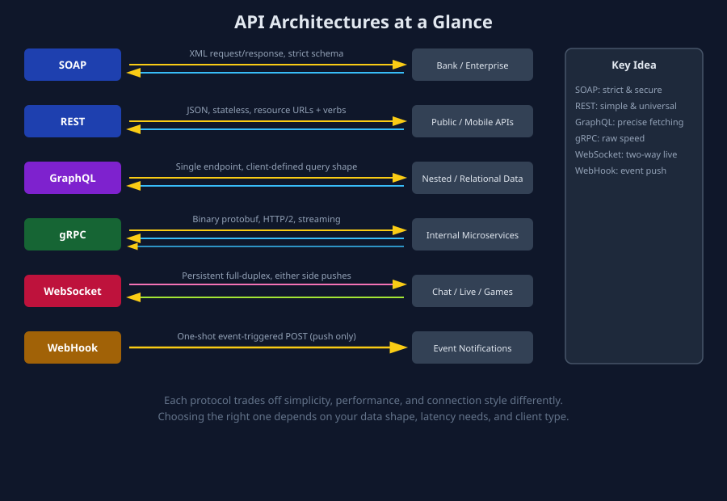

# APIs — A Student's Guide to API Architectures

This folder is a hands-on reference for understanding the major API styles used in the software industry today: **SOAP, REST, GraphQL, gRPC, WebSocket, and WebHook**.

Each subfolder is self-contained and includes:
- `README.md` — real-world example, step-by-step data flow, why it's used, and industry-level context on when/why companies choose it.
- `images/*.svg` — a visual diagram of the data flow for that API type.
- `python_example.py` — runnable Python code (client and/or server).
- `javascript_example.js` — runnable JavaScript/Node.js code (client and/or server).
- Supporting files where relevant (WSDL, `.proto`, GraphQL schema, sample JSON/XML payloads).

## Quick Comparison

| API Type | Data Format | Connection Style | Best For |
|---|---|---|---|
| **SOAP** | XML (strict schema) | Request/Response over HTTP (or other transports) | Enterprise systems needing strict contracts, security standards, and transactional reliability (banking, healthcare) |
| **REST** | JSON (usually) | Stateless Request/Response over HTTP | Simple, cacheable, widely-interoperable public APIs and CRUD services |
| **GraphQL** | JSON, single endpoint | Request/Response, client specifies exact query shape | Complex, nested/relational data consumed by multiple different client types |
| **gRPC** | Binary Protobuf | RPC over persistent HTTP/2, supports streaming | High-performance internal microservice-to-microservice communication |
| **WebSocket** | Any (often JSON/binary frames) | Persistent, full-duplex, bidirectional | Real-time, frequent, bidirectional updates (chat, games, live collaboration) |
| **WebHook** | JSON (usually) | One-shot HTTP POST, event-triggered | Event-driven notifications between systems, eliminating polling |

 
 

## Suggested Learning Order

1. **REST** — start here; it's the most common and intuitive (maps directly to HTTP verbs).
2. **SOAP** — see the more rigid, XML-based predecessor/alternative still used in enterprise systems.
3. **GraphQL** — understand how it solves REST's over-fetching/under-fetching problems.
4. **gRPC** — see how internal microservices optimize for raw performance using binary + streaming.
5. **WebSocket** — learn true real-time, bidirectional communication.
6. **WebHook** — learn the simpler, event-driven "push" pattern used for cross-system notifications.

## Running the Code Examples

Each `python_example.py` and `javascript_example.js` is commented with the exact `pip install` / `npm install` commands needed, and instructions on how to run the server and client halves (usually via a command-line argument like `server` / `client`). These examples are written for **learning purposes** — read the comments alongside the folder's `README.md` to understand what's happening at each step.
