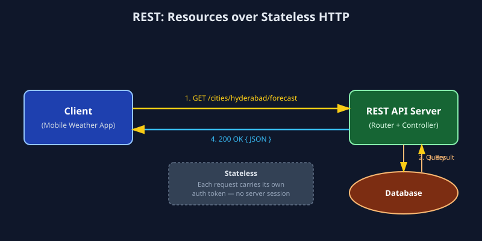

# REST (Representational State Transfer)

## 1. What is REST?

REST is an architectural style (not a strict protocol) for designing networked applications. It treats everything as a **resource**, identified by a URL, and manipulated using standard HTTP verbs: `GET` (read), `POST` (create), `PUT`/`PATCH` (update), `DELETE` (remove). Responses are typically in **JSON**, though XML is also possible. REST APIs are **stateless** — each request from a client contains all the information the server needs, with no session stored server-side between calls.

## 2. Real-World Example

Consider a **weather application** on your phone. When you open the app and select "Hyderabad," the app calls:

```
GET https://api.weather.example.com/v1/cities/hyderabad/forecast
```

The server responds with a JSON payload containing the current temperature, humidity, and a 5-day forecast. If you then favorite the city, the app sends:

```
POST https://api.weather.example.com/v1/users/42/favorites
Body: { "city": "hyderabad" }
```

Every call is self-contained: the URL identifies the resource (`cities/hyderabad/forecast`, `users/42/favorites`), the HTTP verb identifies the action, and the server doesn't need to "remember" anything about the client between requests (authentication is passed via a token in headers on every call).

This pattern — resources + verbs + JSON — is why REST is the backbone of almost every public web API you interact with daily: Twitter/X, GitHub, Google Maps, Stripe (partially), Spotify, weather services, e-commerce product catalogs, etc.

## 3. How It Works (Data Flow)

```
Client (Browser / Mobile App)                REST API Server
       |                                            |
       |--- GET /cities/hyderabad/forecast -------->|
       |    (Headers: Authorization: Bearer ...)     |
       |                                            |
       |                                    Server routes request
       |                                    to the matching resource
       |                                    handler (Controller)
       |                                            |
       |                                    Handler queries Database
       |                                    or cache for the data
       |                                            |
       |<--- 200 OK { JSON payload } ----------------|
       |                                            |
```



**Step-by-step:**
1. Client sends an HTTP request to a specific resource URL using the appropriate verb.
2. The server's router matches the URL + verb to a handler function.
3. The handler fetches/modifies data (often via a database) and applies business logic.
4. The server returns an HTTP status code (`200`, `201`, `404`, `500`, etc.) plus a JSON body.
5. No session state is kept — the next request must again include any necessary auth/context.

## 4. Why It's Used

- **Simplicity:** built directly on HTTP, human-readable, easy to test with a browser or `curl`.
- **Statelessness:** makes horizontal scaling trivial — any server instance can handle any request.
- **Caching:** HTTP-level caching (via `Cache-Control`, `ETag`) works out of the box, improving performance.
- **Wide tooling support:** virtually every language and platform has mature HTTP client libraries.
- **Loose coupling:** clients and servers can evolve independently as long as the contract (URL + payload shape) is respected.

**Trade-offs:** over-fetching/under-fetching data (a mobile client may get more or less than it needs), potential need for many round-trips for related resources, and versioning challenges as APIs evolve — problems that GraphQL was designed to solve.

## 5. Industry-Level Usage — When and Why

| Industry / Use Case | Why REST is chosen |
|---|---|
| **Public Web/Mobile APIs** | Simple, cacheable, widely understood by third-party developers (e.g., GitHub API, Twitter API, Google Maps API). |
| **E-commerce product catalogs** | Resource-oriented model (products, carts, orders) maps naturally to REST endpoints; CDN-level caching boosts performance. |
| **Microservices (internal)** | Statelessness + HTTP simplicity make REST a common choice for service-to-service communication when extreme performance isn't critical. |
| **CRUD-heavy admin dashboards / SaaS backends** | REST maps directly onto standard Create-Read-Update-Delete database operations. |

**When to choose REST:** you need a simple, cacheable, widely-interoperable API — especially for public-facing APIs consumed by many different, unknown clients. If your clients need highly flexible queries over deeply nested data, consider GraphQL instead; if you need extreme low-latency service-to-service calls, consider gRPC.

## 6. Files in this Folder

- `python_example.py` — REST client (using `requests`) and a minimal REST server (using `Flask`).
- `javascript_example.js` — REST client (using `fetch`) and a minimal REST server (using `Express`).
- `sample_response.json` — Example JSON response payload.
- `images/rest_flow.svg` — Visual data-flow diagram.
