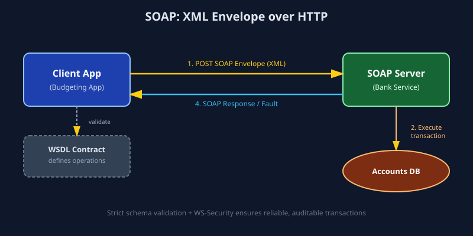

# SOAP (Simple Object Access Protocol)

## 1. What is SOAP?

SOAP is a strict, XML-based messaging protocol used to exchange structured information between applications over a network. Every SOAP message is a complete XML document wrapped inside an **Envelope**, which contains an optional **Header** (metadata like authentication tokens) and a mandatory **Body** (the actual request/response data). SOAP is protocol-agnostic — it usually runs over HTTP, but it can also run over SMTP, TCP, or JMS.

SOAP APIs are described using a **WSDL (Web Services Description Language)** file, which acts as a strict contract defining every operation, input, output, and data type available on the service. See `sample.wsdl` in this folder.

## 2. Real-World Example

Imagine a **bank's fund transfer service**. A third-party finance app (like a budgeting tool) wants to initiate a transfer between two of a customer's accounts held at the bank.

Because money movement requires:
- Guaranteed delivery (the request must not be lost or duplicated)
- Strong typing (amount must always be a valid decimal, account numbers always strings of fixed length)
- Built-in security standards (WS-Security for encrypting/signing messages)
- Formal contracts that both sides can validate against

...the bank exposes a SOAP endpoint. The budgeting app builds an XML request like the one in `sample_request.xml`, sends it via HTTP POST to the bank's endpoint, and the bank replies with a SOAP XML response confirming (or rejecting) the transfer.

This is why almost all **legacy banking, insurance, healthcare (HL7), and payment systems** (e.g., older versions of PayPal's API, SWIFT-adjacent banking middleware) still rely on SOAP — the domain demands airtight contracts and transactional reliability over raw speed.

## 3. How It Works (Data Flow)

```
Client Application                         SOAP Server (Bank)
       |                                            |
       |---(1) Build XML request per WSDL --------->|
       |     (SOAP Envelope: Header + Body)          |
       |                                            |
       |---(2) POST over HTTP/HTTPS ---------------->|
       |                                            |
       |                                    (3) Server validates
       |                                        against WSDL schema
       |                                            |
       |                                    (4) Business logic executes
       |                                        (transfer funds)
       |                                            |
       |<---(5) SOAP XML Response -------------------|
       |     (Envelope: Body with result/fault)      |
       |                                            |
```



**Step-by-step:**
1. Client constructs a SOAP Envelope (XML) following the contract defined in the WSDL.
2. The envelope is sent via an HTTP POST request (with `Content-Type: text/xml` or `application/soap+xml`).
3. The server parses and validates the XML strictly against the WSDL/XSD schema.
4. The server executes the business logic (e.g., a database transaction).
5. The server returns a SOAP response — either a success payload or a `<soap:Fault>` element describing the error.

## 4. Why It's Used

- **Strict contracts (WSDL):** both client and server code can be auto-generated from the WSDL, reducing integration bugs.
- **Built-in standards:** WS-Security (encryption/signing), WS-AtomicTransaction (distributed transactions), WS-ReliableMessaging (guaranteed delivery).
- **Protocol independence:** works over HTTP, SMTP, TCP, message queues — not tied to the web.
- **ACID-like reliability:** critical for financial and healthcare transactions where a lost or duplicated message is unacceptable.

**Trade-offs:** SOAP messages are verbose (pure XML), have higher parsing overhead, and are harder to consume from lightweight clients like mobile apps or JavaScript frontends — which is why REST/GraphQL dominate newer systems.

## 5. Industry-Level Usage — When and Why

| Industry | Why SOAP is chosen |
|---|---|
| **Banking & Payments** | Requires WS-Security, digital signatures, and non-repudiation for regulatory compliance (e.g., SWIFT-adjacent systems, core banking middleware). |
| **Healthcare (HL7 v3, older EHR systems)** | Strict, auditable schemas are mandated for patient data interoperability standards. |
| **Government & Legacy Enterprise Systems** | Many government tenders and enterprise ERPs (SAP, older Oracle systems) still expose SOAP because it was the enterprise standard before REST matured (2000s). |
| **Telecom billing systems** | Needs guaranteed, ordered message delivery for billing accuracy. |

**When to choose SOAP today:** you're integrating with a legacy enterprise system that only exposes SOAP, or your domain has hard compliance/security requirements (WS-Security, formal contracts) that outweigh REST's simplicity. For new greenfield projects without such constraints, REST or gRPC is almost always preferred.

## 6. Files in this Folder

- `python_example.py` — Python client calling a SOAP service using the `zeep` library.
- `javascript_example.js` — Node.js client calling a SOAP service using the `soap` npm package.
- `sample.wsdl` — Example WSDL contract describing the fund transfer operation.
- `sample_request.xml` — Example raw SOAP XML request/response pair.
- `images/soap_flow.svg` — Visual data-flow diagram.
