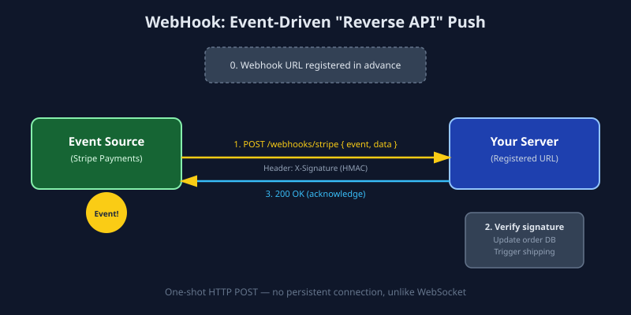

# WebHook

## 1. What is a WebHook?

A WebHook is a way for one application to **notify another application automatically when an event happens**, by sending an HTTP POST request to a pre-registered URL — instead of the second application having to repeatedly ask ("poll") "did anything happen yet?". WebHooks are often called **"reverse APIs"**: rather than the client requesting data, the server pushes data to the client the moment something occurs. Unlike WebSocket, there's no persistent connection — it's just a single, one-way HTTP POST fired at the moment of the event.

## 2. Real-World Example

Consider **Stripe** (a payment processor) and an e-commerce store built on it. When a customer's payment succeeds, the store's backend needs to know **immediately** so it can mark the order as paid and trigger shipping.

Without WebHooks, the store would have to constantly poll Stripe: *"Did payment #123 succeed yet? ... Did it succeed yet? ..."* — wasteful and slow.

Instead:

1. The store registers a URL during setup: `https://mystore.com/webhooks/stripe`
2. When a payment event occurs (success, failure, refund), Stripe's servers immediately send an HTTP POST to that URL with a JSON payload describing the event.
3. The store's server (see `webhook_receiver.py`) receives this POST, verifies it's genuinely from Stripe (via a signature check), and updates the order status.

This exact pattern is used by **GitHub** (notify a CI server when code is pushed), **Stripe/PayPal** (payment events), **Shopify** (order created/updated), **Twilio** (incoming SMS/call events), and **Slack** (incoming messages to a custom integration).

## 3. How It Works (Data Flow)

```
Event Source (Stripe)                     Receiver (Your Store Server)
       |                                            |
       |     (earlier: you registered your          |
       |      webhook URL in Stripe's dashboard)     |
       |                                            |
   [Payment succeeds for order #123]                |
       |                                            |
       |--- POST /webhooks/stripe ------------------>|
       |    { event: "payment_succeeded",             |
       |      order_id: 123, amount: 2500 }           |
       |    Header: Stripe-Signature: t=...,v1=...    |
       |                                            |
       |                                    Verify signature
       |                                    (proves it's really Stripe)
       |                                            |
       |                                    Update order status in DB
       |                                    Trigger shipping workflow
       |                                            |
       |<--- 200 OK (acknowledge receipt) ------------|
       |                                            |
```



**Step-by-step:**

1. The receiving application registers a callback URL with the event source ahead of time (usually via a dashboard or API call).
2. When a relevant event happens, the event source builds a JSON payload describing it.
3. The event source sends a single HTTP POST request to the registered URL — no ongoing connection, just one-shot delivery.
4. The receiver **must respond quickly** (usually `200 OK`) to acknowledge receipt; if it doesn't respond in time, most providers retry with backoff.
5. Security is critical: receivers must verify a signature (e.g., HMAC in a header) to confirm the request truly came from the trusted source and wasn't forged.

## 4. Why It's Used

- **Eliminates polling:** dramatically reduces wasted requests and server load compared to "check if anything changed" loops.
- **Near real-time:** notifications arrive within moments of the event, without maintaining an open connection like WebSocket.
- **Simple to implement:** it's just a normal HTTP POST endpoint — no special protocol or persistent connection needed.
- **Decouples systems:** the event source doesn't need to know anything about the receiver besides its URL.

**Trade-offs:** the receiver's endpoint must be publicly reachable (a challenge for local development — tools like `ngrok` are commonly used), delivery isn't guaranteed unless the provider implements retries, and receivers must handle duplicate deliveries (idempotency) and verify authenticity carefully to avoid spoofed requests.

## 5. Industry-Level Usage — When and Why

| Industry / Use Case                           | Why WebHooks are chosen                                                         |
| --------------------------------------------- | ------------------------------------------------------------------------------- |
| **Payments (Stripe, PayPal, Razorpay)** | Instantly notify merchants of payment success/failure/refund without polling.   |
| **CI/CD & DevOps (GitHub, GitLab)**     | Trigger a build pipeline the moment code is pushed or a PR is opened.           |
| **E-commerce (Shopify)**                | Notify inventory/fulfillment systems the instant an order is placed or updated. |
| **Communications (Twilio, Slack)**      | Deliver incoming SMS, calls, or chat messages to a custom backend in real time. |

**When to choose WebHooks:** you need to notify another system about discrete, occasional events (not continuous real-time streams) and don't want either side to maintain an open connection or poll. For continuous, frequent, bidirectional updates (like live chat or games), use WebSocket instead.

## 6. Files in this Folder

- `webhook_payload.json` — Example webhook event payload (Stripe-style).
- `python_example.py` — WebHook receiver (Flask) and a script simulating the sender.
- `javascript_example.js` — WebHook receiver (Express) and a script simulating the sender.
- `images/webhook_flow.svg` — Visual data-flow diagram.
