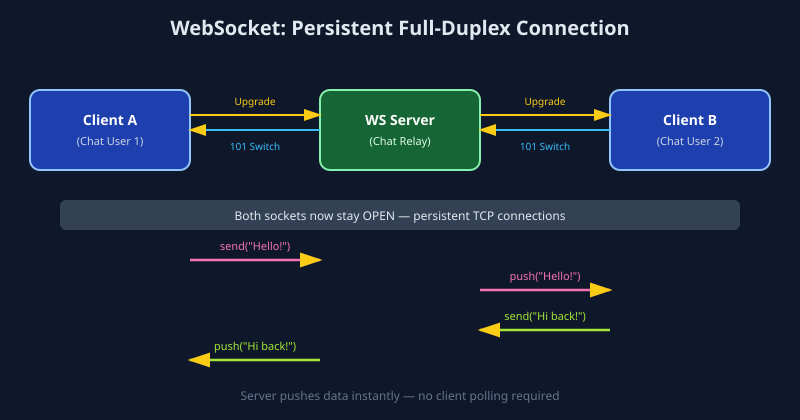

# WebSocket

## 1. What is WebSocket?

WebSocket is a communication protocol that provides a **persistent, full-duplex connection** between a client and a server over a single TCP connection. Unlike HTTP (where the client must always initiate each request), once a WebSocket handshake is complete, **either side can send messages to the other at any time** — no polling, no repeated connection setup. The connection starts as a normal HTTP request (`Upgrade: websocket` header) and then "upgrades" into a raw, low-overhead, bidirectional channel identified by the `ws://` or `wss://` (secure) scheme.

## 2. Real-World Example

Consider a **live chat application** (like WhatsApp Web or Slack). When User A sends a message, User B needs to see it **instantly**, without refreshing the page or the app repeatedly asking the server "any new messages?" (polling).

With WebSocket:

1. Both User A's and User B's clients open a WebSocket connection to the chat server when the app loads.
2. When User A sends a message, it travels to the server over their open socket.
3. The server immediately **pushes** that message down User B's already-open socket — no request needed from User B's side.

This bidirectional, low-latency push capability is why WebSocket (or libraries built on it, like Socket.IO) powers **live chat, multiplayer games, collaborative editing tools (Google Docs-style cursors), live sports scores, stock tickers, and real-time notifications**.

## 3. How It Works (Data Flow)

```
Client A                    WebSocket Server                    Client B
   |                                |                                |
   |--- HTTP Upgrade Request ------>|                                |
   |<-- 101 Switching Protocols ----|                                |
   |         (handshake done, persistent TCP connection open)         |
   |                                |<--- HTTP Upgrade Request -------|
   |                                |---- 101 Switching Protocols --->|
   |                                |                                |
   |--- send("Hello!") ------------>|                                |
   |                                |--- push("Hello!") ------------->|
   |                                |                                |
   |                                |<--- send("Hi back!") -----------|
   |<-- push("Hi back!") -----------|                                |
```



**Step-by-step:**

1. Client sends a normal HTTP request with an `Upgrade: websocket` header.
2. Server responds with `101 Switching Protocols`, completing the handshake.
3. The underlying TCP connection stays open — both sides can now send frames (messages) at any time.
4. The server maintains a registry of connected clients (e.g., a chat room's socket list) to know who to push messages to.
5. The connection stays alive until explicitly closed by either side (or a timeout/heartbeat failure).

## 4. Why It's Used

- **True bidirectional, real-time communication:** the server can push data without the client asking first.
- **Low overhead after handshake:** no repeated HTTP headers on every message, unlike polling.
- **Lower latency than polling:** messages arrive the instant they're sent, not on the next poll interval.
- **Efficient for high-frequency updates:** ideal for anything needing many small, frequent messages (typing indicators, live cursors, game state).

**Trade-offs:** stateful connections are harder to scale horizontally (need sticky sessions or a shared pub/sub backend like Redis), doesn't work well with traditional HTTP caching/CDNs, and requires careful handling of reconnects/heartbeats for reliability.

## 5. Industry-Level Usage — When and Why

| Industry / Use Case                                     | Why WebSocket is chosen                                                              |
| ------------------------------------------------------- | ------------------------------------------------------------------------------------ |
| **Messaging apps (WhatsApp Web, Slack, Discord)** | Instant bidirectional delivery of chat messages and typing indicators.               |
| **Online multiplayer games**                      | Real-time player position/state sync with minimal latency.                           |
| **Financial trading platforms**                   | Live stock/crypto price ticks pushed to thousands of clients simultaneously.         |
| **Collaborative tools (Google Docs, Figma)**      | Real-time cursor positions and document edits broadcast to all active collaborators. |

**When to choose WebSocket:** you need true real-time, bidirectional communication with frequent small messages. If updates are infrequent or one-directional (server → client only, occasionally), consider **WebHooks** or Server-Sent Events instead, which are simpler.

## 6. Files in this Folder

- `python_example.py` — WebSocket server and client using the `websockets` library.
- `javascript_example.js` — WebSocket server (using `ws`) and browser-native client.
- `images/websocket_flow.svg` — Visual data-flow diagram.
