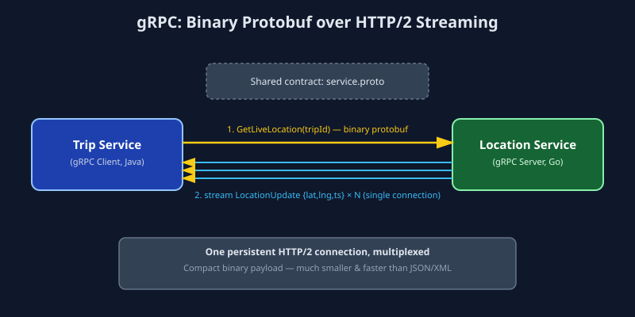

# gRPC (Google Remote Procedure Call)

## 1. What is gRPC?

gRPC is a high-performance **Remote Procedure Call (RPC)** framework built by Google. Instead of thinking in terms of URLs and HTTP verbs (like REST), gRPC lets a client call a method on a remote server **as if it were a local function call**. It uses:

- **Protocol Buffers (protobuf)** — a compact binary serialization format, far smaller and faster to parse than JSON/XML.
- **HTTP/2** as the transport — enabling multiplexed requests over a single connection and true bi-directional streaming.

A gRPC service contract is defined in a `.proto` file (see `service.proto`), from which client and server code is **auto-generated** in almost any language.

## 2. Real-World Example

Consider a **ride-sharing app's backend microservices**. The "Trip Service" needs to continuously fetch the driver's live GPS location from the "Location Service" to show real-time movement on the rider's map, while simultaneously the "Pricing Service" needs to make rapid internal calls to calculate fare estimates as traffic conditions change.

These are **internal, high-frequency, low-latency service-to-service calls** — not public-facing APIs. gRPC is ideal here because:
- Protobuf's binary format is far smaller/faster than JSON over REST.
- HTTP/2 streaming allows the Location Service to **continuously push** GPS coordinates to the Trip Service without repeated polling.
- Auto-generated strongly-typed client/server stubs eliminate manual serialization bugs across services written in different languages (e.g., Location Service in Go, Trip Service in Java).

This is exactly why companies like **Google, Netflix, Square, and Uber** use gRPC extensively for internal microservice communication.

## 3. How It Works (Data Flow)

```
Trip Service (gRPC Client)              Location Service (gRPC Server)
       |                                          |
       |--- Call GetLiveLocation(tripId) -------->|
       |    (serialized as compact protobuf       |
       |     binary, sent over HTTP/2)              |
       |                                          |
       |                                 Server streams back
       |                                 location updates as
       |                                 they happen (server-streaming)
       |                                          |
       |<--- LocationUpdate {lat, lng, ts} --------|
       |<--- LocationUpdate {lat, lng, ts} --------|
       |<--- LocationUpdate {lat, lng, ts} --------|
       |          (single persistent connection)    |
```



**Step-by-step:**
1. Both services share a `.proto` contract; each generates strongly-typed stub code in its own language.
2. The client calls a method on the generated stub as if it were local (e.g., `client.GetLiveLocation(tripId)`).
3. Behind the scenes, the request is serialized into compact binary protobuf and sent over an HTTP/2 connection.
4. gRPC supports four call types: unary (1 request → 1 response), server-streaming, client-streaming, and bi-directional streaming.
5. The server deserializes the protobuf, executes logic, and streams responses back over the same persistent connection.

## 4. Why It's Used

- **Speed:** binary protobuf serialization + HTTP/2 multiplexing makes gRPC significantly faster than REST/JSON for high-throughput internal calls.
- **Strongly typed contracts:** the `.proto` file generates client/server code, catching mismatches at compile time instead of runtime.
- **Native streaming:** built-in support for real-time, bi-directional data streams (ideal for live tracking, chat, telemetry).
- **Polyglot microservices:** works seamlessly across services written in different languages.

**Trade-offs:** not human-readable (binary format makes debugging harder without tooling), poor native browser support (needs gRPC-Web proxy), and it's overkill for simple public-facing CRUD APIs.

## 5. Industry-Level Usage — When and Why

| Industry / Use Case | Why gRPC is chosen |
|---|---|
| **Ride-sharing / logistics (Uber, Lyft)** | Real-time GPS streaming between dozens of internal microservices demands low latency and native streaming. |
| **Video streaming platforms (Netflix)** | Internal service mesh communication needs to handle massive request volume with minimal serialization overhead. |
| **Financial trading systems** | Sub-millisecond latency requirements make binary protobuf + HTTP/2 essential over JSON/REST. |
| **IoT & telemetry pipelines** | Devices stream continuous sensor data efficiently using client-streaming RPCs. |

**When to choose gRPC:** internal, performance-critical service-to-service communication, especially involving streaming data or polyglot microservice architectures. Avoid it for public APIs consumed by browsers/third parties (poor native browser support, not human-readable) — use REST or GraphQL there instead.

## 6. Files in this Folder

- `service.proto` — Protocol Buffers contract defining the LocationService.
- `python_example.py` — gRPC client and server using `grpcio`.
- `javascript_example.js` — gRPC client and server using `@grpc/grpc-js`.
- `images/grpc_flow.svg` — Visual data-flow diagram.

> Note: Real gRPC projects generate `*_pb2.py` / `*_pb.js` stub files from `service.proto` using `protoc`. This is shown as a step in the code comments.
